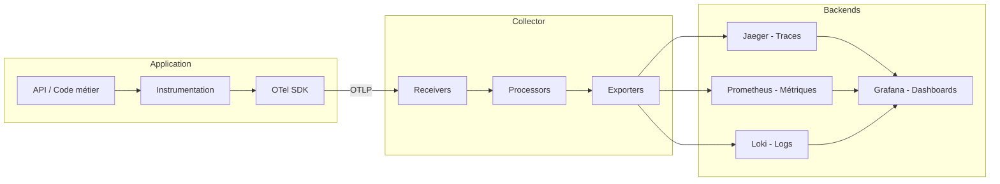
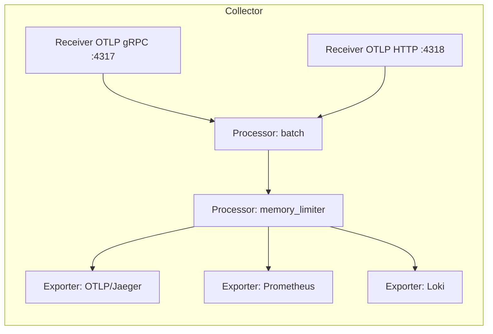

import OtelFlowAnimation from '@site/src/components/OtelFlowAnimation';

# Architecture OpenTelemetry

L'architecture d'OpenTelemetry se compose de trois couches principales : l'**instrumentation** dans votre application, le **SDK** qui collecte et exporte les données, et le **Collector** qui les traite et les route.

## Vue d'ensemble



---

## Composants du SDK

Le SDK OpenTelemetry est le cœur de l'instrumentation. Il fournit les **Providers** pour chaque signal.

### TracerProvider

Le `TracerProvider` gère la création de traces et de spans.

| Composant | Rôle |
|-----------|------|
| **Tracer** | Crée des spans |
| **SpanProcessor** | Traite les spans (batch, simple) |
| **SpanExporter** | Exporte les spans vers un backend |
| **Sampler** | Décide quels spans sont enregistrés |

### MeterProvider

Le `MeterProvider` gère la création et la collecte des métriques.

| Composant | Rôle |
|-----------|------|
| **Meter** | Crée des instruments (Counter, Histogram, etc.) |
| **MetricReader** | Lit et exporte les métriques périodiquement |
| **MetricExporter** | Exporte les métriques vers un backend |
| **View** | Personnalise l'agrégation des métriques |

### LoggerProvider

Le `LoggerProvider` connecte les frameworks de logging existants à OpenTelemetry.

| Composant | Rôle |
|-----------|------|
| **Logger** | Enregistre des LogRecords |
| **LogRecordProcessor** | Traite les logs avant export |
| **LogRecordExporter** | Exporte les logs vers un backend |

:::info Bridge vs API directe
Pour les logs, OpenTelemetry utilise un modèle de **bridge** : votre code continue d'utiliser le framework de logging natif (ILogger en .NET, SLF4J en Java), et le SDK OTel capture ces logs automatiquement.
:::

---

## Exporters

Les exporters transmettent les données de télémétrie vers les backends.

| Exporter | Protocole | Signaux supportés |
|----------|-----------|-------------------|
| **OTLP** | gRPC / HTTP | Traces, Métriques, Logs |
| **Jaeger** | gRPC / Thrift | Traces |
| **Prometheus** | HTTP (pull) | Métriques |
| **Console** | stdout | Traces, Métriques, Logs |
| **Zipkin** | HTTP | Traces |

:::tip OTLP recommandé
Le protocole **OTLP** (OpenTelemetry Protocol) est le format natif d'OpenTelemetry. Utilisez-le autant que possible pour bénéficier du support complet des trois signaux.
:::

---

## Le Collector

Le Collector est un composant intermédiaire qui reçoit, traite et exporte les données de télémétrie. Il découple votre application des backends.



Pour une description détaillée du Collector, consultez la page [Le Collector OpenTelemetry](./collector).

---

## Flux de données animé

<OtelFlowAnimation />

---

## Modes de déploiement

OpenTelemetry supporte deux modes d'export :

### 1. Direct (sans Collector)

```
Application → Backend
```

Simple mais couplé au backend. À éviter en production.

### 2. Via le Collector (recommandé)

```
Application → Collector → Backend(s)
```

:::tip Pourquoi utiliser le Collector ?
- **Découplage** — Changez de backend sans modifier votre application
- **Traitement** — Filtrage, enrichissement, échantillonnage côté Collector
- **Fiabilité** — Buffering et retry en cas d'indisponibilité du backend
- **Multi-destination** — Envoyez les mêmes données vers plusieurs backends
:::
