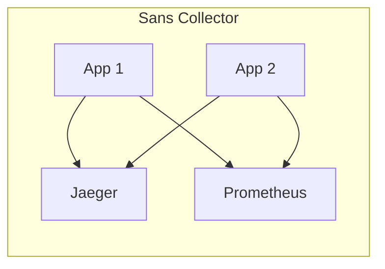
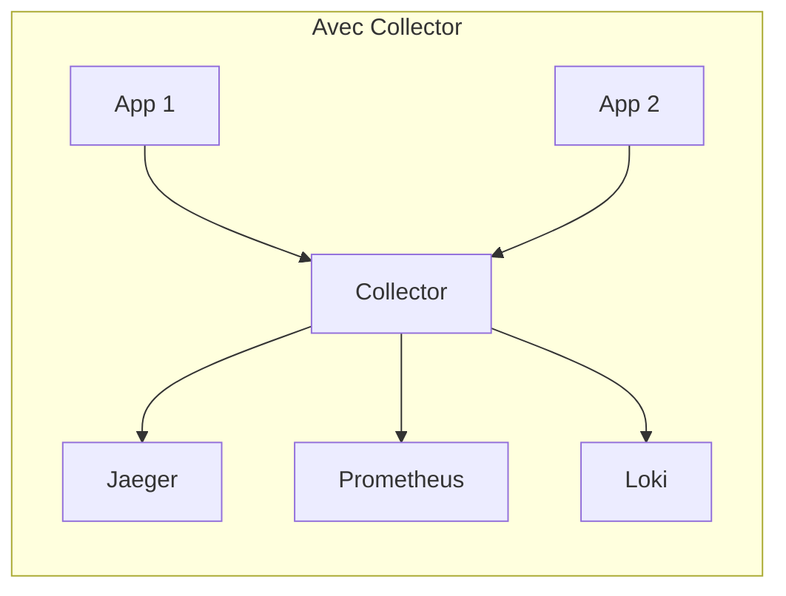

# Le Collector OpenTelemetry

Le **Collector** est un proxy de télémétrie qui reçoit, traite et exporte les données d'observabilité. C'est le composant central de l'architecture OpenTelemetry.

## Pourquoi un Collector ?

Sans Collector, chaque application doit connaître les endpoints de chaque backend. Le Collector centralise cette logique :





---

## Architecture du Collector

Le Collector est organisé en **pipelines** composées de trois types de composants :


---

## Receivers

Les **Receivers** sont les points d'entrée des données. Ils écoutent sur des ports et acceptent les données dans différents formats.

| Receiver | Protocole | Port par défaut | Signaux |
|----------|-----------|-----------------|---------|
| **otlp** (gRPC) | gRPC | 4317 | Traces, Métriques, Logs |
| **otlp** (HTTP) | HTTP/protobuf | 4318 | Traces, Métriques, Logs |
| **prometheus** | HTTP (scrape) | configurable | Métriques |
| **jaeger** | gRPC / Thrift | 14250, 14268 | Traces |

### Configuration

```yaml
receivers:
  otlp:
    protocols:
      grpc:
        endpoint: 0.0.0.0:4317
      http:
        endpoint: 0.0.0.0:4318
```

---

## Processors

Les **Processors** transforment, filtrent ou enrichissent les données entre la réception et l'export.

### Processors courants

| Processor | Rôle |
|-----------|------|
| **batch** | Regroupe les données en lots pour optimiser l'export |
| **memory_limiter** | Limite la consommation mémoire du Collector |
| **attributes** | Ajoute, modifie ou supprime des attributs |
| **filter** | Filtre les données selon des critères |
| **resource** | Enrichit les attributs de ressource |
| **tail_sampling** | Échantillonnage basé sur la trace complète |

### Configuration

```yaml
processors:
  batch:
    timeout: 5s
    send_batch_size: 1024
    send_batch_max_size: 2048

  memory_limiter:
    check_interval: 1s
    limit_mib: 512
    spike_limit_mib: 128
```

:::caution memory_limiter
Le processor `memory_limiter` devrait toujours être le **premier** dans la chaîne de processors pour protéger le Collector contre les surcharges.
:::

---

## Exporters

Les **Exporters** envoient les données traitées vers les backends de stockage et de visualisation.

| Exporter | Backend | Signaux |
|----------|---------|---------|
| **otlp** | Tout backend OTLP | Traces, Métriques, Logs |
| **otlphttp** | Jaeger, Tempo, etc. | Traces, Métriques, Logs |
| **prometheus** | Prometheus (scrape) | Métriques |
| **loki** | Grafana Loki | Logs |
| **debug** | Console (stdout) | Tous |

### Configuration

```yaml
exporters:
  otlp/jaeger:
    endpoint: jaeger:4317
    tls:
      insecure: true

  prometheus:
    endpoint: 0.0.0.0:8889

  loki:
    endpoint: http://loki:3100/loki/api/v1/push
```

---

## Pipelines

Les **pipelines** assemblent les receivers, processors et exporters pour chaque signal :

```yaml
service:
  pipelines:
    traces:
      receivers: [otlp]
      processors: [memory_limiter, batch]
      exporters: [otlp/jaeger]

    metrics:
      receivers: [otlp]
      processors: [memory_limiter, batch]
      exporters: [prometheus]

    logs:
      receivers: [otlp]
      processors: [memory_limiter, batch]
      exporters: [loki]
```

:::tip Pipelines multiples
Vous pouvez définir plusieurs pipelines pour un même signal, par exemple pour envoyer les traces vers Jaeger **et** vers un stockage long terme.
:::

---

## Configuration complète exemple

```yaml
receivers:
  otlp:
    protocols:
      grpc:
        endpoint: 0.0.0.0:4317
      http:
        endpoint: 0.0.0.0:4318

processors:
  memory_limiter:
    check_interval: 1s
    limit_mib: 512
  batch:
    timeout: 5s

exporters:
  otlp/jaeger:
    endpoint: jaeger:4317
    tls:
      insecure: true
  prometheus:
    endpoint: 0.0.0.0:8889
  loki:
    endpoint: http://loki:3100/loki/api/v1/push

service:
  pipelines:
    traces:
      receivers: [otlp]
      processors: [memory_limiter, batch]
      exporters: [otlp/jaeger]
    metrics:
      receivers: [otlp]
      processors: [memory_limiter, batch]
      exporters: [prometheus]
    logs:
      receivers: [otlp]
      processors: [memory_limiter, batch]
      exporters: [loki]
```
