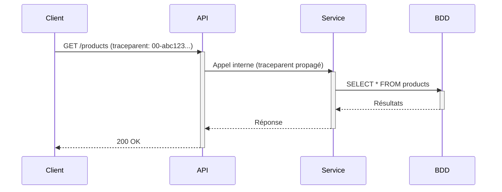
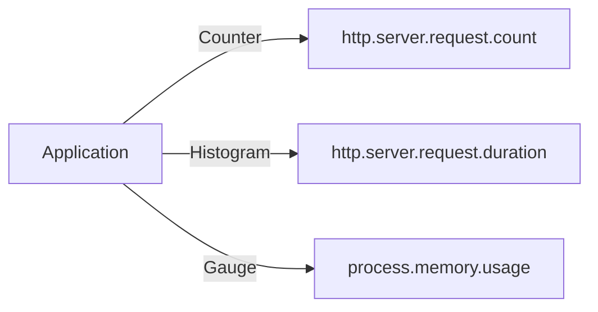
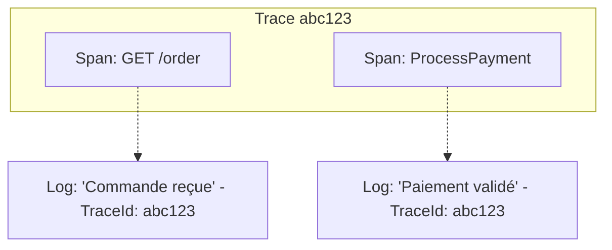

import SignalBadge from '@site/src/components/SignalBadge';

# Les Signaux de Télémétrie

OpenTelemetry unifie la collecte de trois types de signaux. Chacun répond à des questions différentes et se complète pour offrir une vue complète de vos applications.

---

## Traces

<SignalBadge signal="traces" title="Traces distribuées" />

Une **trace** représente le parcours complet d'une requête à travers un système distribué. Elle est composée de **spans** (segments) qui décrivent chaque opération.

### Concepts clés

- **Trace** — Un arbre de spans partageant un même `TraceId`
- **Span** — Une unité de travail avec un nom, une durée, des attributs et un statut
- **SpanContext** — Le contexte propagé entre services (`TraceId`, `SpanId`, `TraceFlags`)
- **Context Propagation** — Le mécanisme qui transmet le contexte entre services (via headers HTTP, par exemple)

### Propagation du contexte

:::tip Corrélation
Grâce au `TraceId` partagé, vous pouvez visualiser l'ensemble du parcours d'une requête dans Jaeger, même si elle traverse plusieurs services.
:::

### Anatomie d'un Span

| Champ | Description |
|-------|-------------|
| `TraceId` | Identifiant unique de la trace (128 bits) |
| `SpanId` | Identifiant unique du span (64 bits) |
| `ParentSpanId` | Lien vers le span parent |
| `Name` | Nom de l'opération (ex: `GET /products`) |
| `StartTime` / `EndTime` | Horodatage de début et fin |
| `Attributes` | Paires clé-valeur décrivant l'opération |
| `Events` | Événements horodatés au sein du span |
| `Status` | `Ok`, `Error`, ou `Unset` |

---

## Métriques

<SignalBadge signal="metrics" title="Métriques" />

Les **métriques** sont des mesures numériques agrégées dans le temps. Elles permettent de surveiller la santé et les performances de votre application.

### Types d'instruments

| Instrument | Description | Exemple |
|------------|-------------|---------|
| **Counter** | Valeur croissante uniquement | Nombre de requêtes traitées |
| **UpDownCounter** | Valeur pouvant augmenter ou diminuer | Nombre de connexions actives |
| **Histogram** | Distribution de valeurs | Durée des requêtes |
| **Gauge** | Valeur ponctuelle | Utilisation mémoire |
| **Observable** (async) | Mesure collectée par callback | Température CPU |

:::info Agrégation
Contrairement aux traces et aux logs, les métriques sont **agrégées** au niveau du SDK avant d'être exportées. Cela réduit considérablement le volume de données transmises.
:::

### Exemple de métriques

---

## Logs

<SignalBadge signal="logs" title="Logs structurés" />

Les **logs** sont des enregistrements horodatés d'événements. Avec OpenTelemetry, les logs deviennent **structurés** et **corrélés** aux traces.

### Caractéristiques des logs OTel

- **Structurés** — Format clé-valeur plutôt que texte libre
- **Corrélés** — Contiennent le `TraceId` et `SpanId` du contexte actif
- **Niveaux de sévérité** — `Trace`, `Debug`, `Info`, `Warn`, `Error`, `Fatal`
- **Intégrés au SDK** — Utilisation des frameworks de logging existants (ILogger, SLF4J)

:::caution Logs vs Span Events
Les **Span Events** sont des événements attachés à un span spécifique. Les **Logs** sont des enregistrements indépendants. Utilisez les Span Events pour des événements directement liés à une opération, et les Logs pour des événements applicatifs généraux.
:::

### Corrélation Traces ↔ Logs

Grâce à la corrélation, vous pouvez naviguer d'une trace vers ses logs associés et vice versa.

---

## Résumé

| Signal | Volume | Granularité | Coût | Usage principal |
|--------|--------|-------------|------|-----------------|
| **Traces** | Moyen | Par requête | Modéré | Debugging distribué |
| **Métriques** | Faible | Agrégé | Faible | Monitoring / Alerting |
| **Logs** | Élevé | Par événement | Élevé | Diagnostic détaillé |

:::tip Stratégie d'observabilité
Commencez par les **métriques** pour détecter les problèmes, utilisez les **traces** pour les localiser, et les **logs** pour comprendre les détails.
:::
