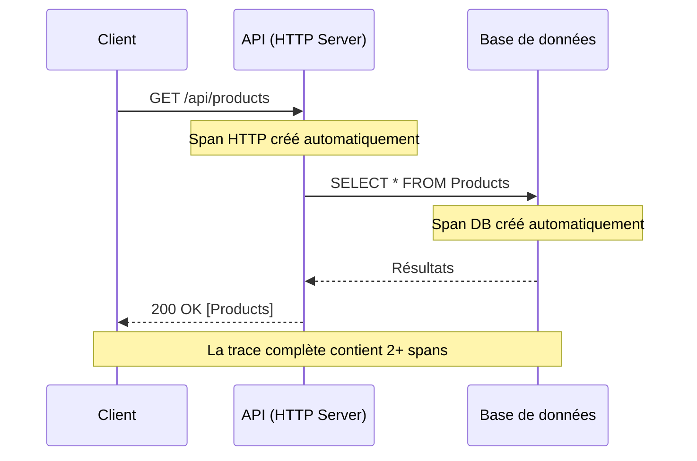
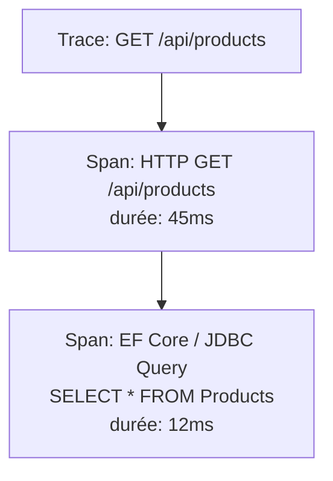

import StepHeader from '@site/src/components/StepHeader';
import Tabs from '@theme/Tabs';
import TabItem from '@theme/TabItem';
import ValidationChecklist from '@site/src/components/ValidationChecklist';
import SignalBadge from '@site/src/components/SignalBadge';
import TerminalOutput from '@site/src/components/TerminalOutput';

<StepHeader number={1} title="Auto-instrumentation" description="Découvrir les traces automatiques sans écrire de code d'instrumentation" />

## Objectif

L'auto-instrumentation (ou instrumentation zero-code) permet de capturer automatiquement des traces
sans modifier le code applicatif. Dans cette étape, vous allez comprendre comment les frameworks
.NET Aspire et Spring Boot génèrent des traces HTTP et base de données de manière transparente.

<SignalBadge signal="traces" title="Traces automatiques">
  L'auto-instrumentation capture les **spans HTTP entrants/sortants** et les **requêtes base de données**
  automatiquement. Chaque appel d'API génère une trace composée de plusieurs spans, formant un arbre
  d'appels que nous pouvons visualiser dans Jaeger ou le Dashboard Aspire.
</SignalBadge>

## Comment fonctionne l'auto-instrumentation ?



Chaque couche traversée par la requête génère un **span** automatiquement. L'ensemble de ces spans
forme une **trace** — une vue complète du parcours de la requête.

## Explorer l'auto-instrumentation

<Tabs groupId="stack" defaultValue="dotnet" values={[{label: '.NET 10 / Aspire', value: 'dotnet'}, {label: 'Java 21 / Spring Boot', value: 'java'}]}>
<TabItem value="dotnet">

### Auto-instrumentation avec .NET Aspire

Dans le projet ShopTrack, l'auto-instrumentation est configurée via le mécanisme
**ServiceDefaults** d'Aspire. Ouvrez le fichier `Extensions.cs` du
projet `ShopTrack.ServiceDefaults` :

```csharp
// ShopTrack.ServiceDefaults/Extensions.cs
public static IHostApplicationBuilder AddServiceDefaults(
    this IHostApplicationBuilder builder)
{
    builder.ConfigureOpenTelemetry();
    // ... autres configurations
    return builder;
}

private static IHostApplicationBuilder ConfigureOpenTelemetry(
    this IHostApplicationBuilder builder)
{
    builder.Logging.AddOpenTelemetry(logging =>
    {
        logging.IncludeFormattedMessage = true;
        logging.IncludeScopes = true;
    });

    builder.Services.AddOpenTelemetry()
        .WithMetrics(metrics =>
        {
            metrics.AddAspNetCoreInstrumentation()
                   .AddHttpClientInstrumentation()
                   .AddRuntimeInstrumentation();
        })
        .WithTracing(tracing =>
        {
            tracing.AddAspNetCoreInstrumentation()
                   .AddHttpClientInstrumentation()
                   .AddEntityFrameworkCoreInstrumentation();
        });

    return builder;
}
```

Dans `Program.cs` de l'API, un simple appel active toute l'instrumentation :

```csharp
// ShopTrack.Api/Program.cs
var builder = WebApplication.CreateBuilder(args);
builder.AddServiceDefaults(); // ← Active l'auto-instrumentation
```

:::info Ce qui est instrumenté automatiquement
- **ASP.NET Core** — Tous les appels HTTP entrants (spans serveur)
- **HttpClient** — Tous les appels HTTP sortants (spans client)
- **Entity Framework Core** — Toutes les requêtes SQL
- **Runtime .NET** — GC, thread pool, allocations
:::

### Visualiser dans le Dashboard Aspire

1. Ouvrez le Dashboard Aspire sur [https://localhost:18888](https://localhost:18888)
2. Cliquez sur l'onglet **Traces**
3. Déclenchez une requête :

<TerminalOutput title="Générer une trace">
```bash
curl -k https://localhost:7275/api/products
```
</TerminalOutput>

Dans le Dashboard, vous verrez apparaître une trace avec un **span HTTP**
parent et un **span Entity Framework** enfant montrant la requête SQL exécutée.

</TabItem>
<TabItem value="java">

### Auto-instrumentation avec Spring Boot

Spring Boot propose une intégration native avec OpenTelemetry via le starter
`opentelemetry-spring-boot-starter`. Vérifiez les dépendances dans
`pom.xml` :

```java
<!-- pom.xml -->
<dependencies>
    <dependency>
        <groupId>org.springframework.boot</groupId>
        <artifactId>spring-boot-starter-web</artifactId>
    </dependency>
    <dependency>
        <groupId>org.springframework.boot</groupId>
        <artifactId>spring-boot-starter-actuator</artifactId>
    </dependency>
    <dependency>
        <groupId>io.opentelemetry.instrumentation</groupId>
        <artifactId>opentelemetry-spring-boot-starter</artifactId>
    </dependency>
</dependencies>
```

La configuration se fait dans `application.yml` :

```yaml
# application.yml
spring:
  application:
    name: shoptrack-api

otel:
  sdk:
    disabled: false
  traces:
    exporter: otlp
  exporter:
    otlp:
      endpoint: http://localhost:4318
      protocol: http/protobuf
```

:::info Ce qui est instrumenté automatiquement
- **Spring MVC** — Tous les appels HTTP entrants via les contrôleurs
- **RestTemplate / WebClient** — Appels HTTP sortants
- **JDBC** — Requêtes base de données
- **Spring Data JPA** — Opérations de repository
:::

### Visualiser dans Jaeger

1. Ouvrez Jaeger sur [http://localhost:16686](http://localhost:16686)
2. Sélectionnez le service **shoptrack-api**
3. Déclenchez une requête :

<TerminalOutput title="Générer une trace">
```bash
curl http://localhost:8080/api/products
```
</TerminalOutput>

Cliquez sur **Find Traces** puis sur une trace pour voir le **waterfall**
avec le span HTTP parent et le span JDBC enfant.

</TabItem>
</Tabs>

## Anatomie d'une trace

Une trace est composée de **spans** organisés hiérarchiquement :



Chaque span contient :
- **Nom de l'opération** — ex: `GET /api/products`
- **Durée** — temps d'exécution
- **Attributs** — métadonnées (method, status_code, db.statement, etc.)
- **Parent** — référence au span parent (pour la hiérarchie)
- **SpanContext** — TraceId + SpanId pour la corrélation

## Exercice : Explorer les attributs

1. Faites un appel `GET /api/products`
2. Trouvez la trace dans Jaeger ou le Dashboard Aspire
3. Ouvrez le span HTTP et examinez les attributs :
   - `http.method` = GET
   - `http.route` = /api/products
   - `http.status_code` = 200
4. Ouvrez le span DB et trouvez :
   - `db.system` (le type de base de données)
   - `db.statement` (la requête SQL)

## Aide & Astuces

<details>
<summary>Pas de traces dans le Dashboard / Jaeger</summary>

Vérifiez que l'application est bien démarrée et que vous avez effectué au moins un appel HTTP.
Les traces n'apparaissent qu'après qu'une requête a été traitée.

Pour .NET, vérifiez que `AddServiceDefaults()` est bien appelé dans `Program.cs`.
Pour Java, vérifiez que le starter OpenTelemetry est dans les dépendances.
</details>

<details>
<summary>La trace ne montre qu'un seul span</summary>

Si vous ne voyez que le span HTTP sans le span DB :
- Vérifiez que la requête accède bien à la base de données
- Pour .NET, assurez-vous que `AddEntityFrameworkCoreInstrumentation()` est configuré
- Pour Java, vérifiez que le driver JDBC est instrumenté
</details>

<details>
<summary>Le nom du service est incorrect</summary>

Le nom du service affiché dans Jaeger provient de la configuration OpenTelemetry :
- .NET : configuré via `service.name` dans les ressources OTel ou le nom du projet Aspire
- Java : configuré via `spring.application.name` dans `application.yml`
</details>

## Checklist de validation

<ValidationChecklist items={[
  "Traces HTTP visibles dans le dashboard",
  "Span GET /api/products visible",
  "Span de la requête DB visible",
  "Trace contient au moins 2 spans (HTTP + DB)"
]} />
