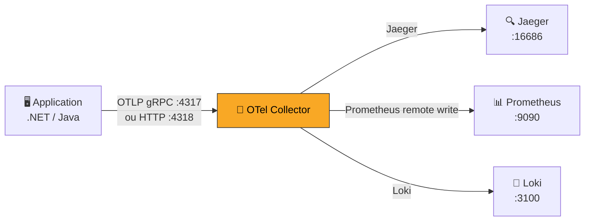

import StepHeader from '@site/src/components/StepHeader';
import Tabs from '@theme/Tabs';
import TabItem from '@theme/TabItem';
import ValidationChecklist from '@site/src/components/ValidationChecklist';
import SignalBadge from '@site/src/components/SignalBadge';
import TerminalOutput from '@site/src/components/TerminalOutput';

<StepHeader number={2} title="Exporter OTLP" description="Envoyer la télémétrie vers les backends d'observabilité via le protocole OTLP" />

## Objectif

Le protocole **OTLP** (OpenTelemetry Protocol) est le standard pour transmettre la télémétrie
(traces, métriques, logs) vers un **Collector OpenTelemetry** qui les distribue ensuite vers
les différents backends. Dans cette étape, vous allez configurer l'export OTLP de votre application
vers le Collector, puis vérifier que les traces arrivent dans Jaeger.

<SignalBadge signal="traces" title="Pipeline de télémétrie">
  Le Collector OpenTelemetry agit comme un **hub central** : il reçoit la télémétrie de vos
  applications, la transforme si nécessaire, et l'exporte vers un ou plusieurs backends
  (Jaeger, Prometheus, Loki). C'est l'architecture recommandée en production.
</SignalBadge>

## Architecture du pipeline



Le Collector est configuré dans `infra/otel-collector-config.yml` avec trois composants :
- **Receivers** — Reçoivent la télémétrie (OTLP gRPC et HTTP)
- **Processors** — Transforment les données (batch, ajout d'attributs)
- **Exporters** — Envoient vers les backends (Jaeger, Prometheus, Loki)

## Comprendre la configuration du Collector

Examinez le fichier de configuration du Collector :

```yaml
# infra/otel-collector-config.yml (extrait)
receivers:
  otlp:
    protocols:
      grpc:
        endpoint: 0.0.0.0:4317
      http:
        endpoint: 0.0.0.0:4318

processors:
  batch:
    timeout: 5s
    send_batch_size: 1024

exporters:
  otlp/jaeger:
    endpoint: jaeger:4317
    tls:
      insecure: true

service:
  pipelines:
    traces:
      receivers: [otlp]
      processors: [batch]
      exporters: [otlp/jaeger]
```

:::info gRPC vs HTTP
OTLP supporte deux protocoles de transport :
- **gRPC** (port 4317) — Plus performant, binaire, recommandé en production
- **HTTP/protobuf** (port 4318) — Plus simple, traverse les proxys HTTP facilement

Les deux fonctionnent avec le Collector. Le choix dépend de votre infrastructure.
:::

## Configurer l'export OTLP

<Tabs groupId="stack">
<TabItem value="dotnet" label=".NET 10 / Aspire">

### Configuration OTLP dans .NET Aspire

Avec Aspire, l'export OTLP est déjà configuré via les **ServiceDefaults**.
L'endpoint est défini via la variable d'environnement `OTEL_EXPORTER_OTLP_ENDPOINT`.

Vérifiez la configuration dans `appsettings.json` ou les variables d'environnement :

```json
// appsettings.json
{
  "OTEL_EXPORTER_OTLP_ENDPOINT": "http://localhost:4318",
  "OTEL_SERVICE_NAME": "shoptrack-api"
}
```

Ou via les variables d'environnement dans le AppHost :

```csharp
// ShopTrack.AppHost/Program.cs
var api = builder.AddProject<Projects.ShopTrack_Api>("shoptrack-api")
    .WithEnvironment("OTEL_EXPORTER_OTLP_ENDPOINT", "http://localhost:4318")
    .WithEnvironment("OTEL_SERVICE_NAME", "shoptrack-api");
```

L'export OTLP est activé dans les ServiceDefaults via :

```csharp
// Extensions.cs — dans ConfigureOpenTelemetry()
builder.Services.AddOpenTelemetry()
    .WithTracing(tracing =>
    {
        tracing.AddAspNetCoreInstrumentation()
               .AddHttpClientInstrumentation()
               .AddEntityFrameworkCoreInstrumentation();
    })
    .UseOtlpExporter(); // ← Exporte via OTLP
```

:::tip Variable OTEL standard
Le SDK OpenTelemetry .NET respecte les variables d'environnement standard :
- `OTEL_EXPORTER_OTLP_ENDPOINT` — URL du Collector
- `OTEL_EXPORTER_OTLP_PROTOCOL` — `grpc` ou `http/protobuf`
- `OTEL_SERVICE_NAME` — Nom du service
:::

### Vérifier l'export

<TerminalOutput title="Générer du trafic et vérifier">

```bash
# Générer quelques traces
for i in {1..5}; do curl -k https://localhost:7275/api/products; done

# Vérifier les logs du Collector
docker compose logs otel-collector | tail -20
```

</TerminalOutput>

</TabItem>
<TabItem value="java" label="Java 21 / Spring Boot">

### Configuration OTLP dans Spring Boot

Configurez l'exporter OTLP dans `application.yml` pour envoyer les traces
vers le Collector OpenTelemetry :

```yaml
# application.yml
spring:
  application:
    name: shoptrack-api

otel:
  sdk:
    disabled: false
  traces:
    exporter: otlp
  exporter:
    otlp:
      endpoint: http://localhost:4318
      protocol: http/protobuf
  resource:
    attributes:
      service.name: shoptrack-api
```

Vous pouvez aussi utiliser les **variables d'environnement** standard
OpenTelemetry, qui prennent priorité sur la configuration YAML :

```bash
export OTEL_EXPORTER_OTLP_ENDPOINT=http://localhost:4318
export OTEL_EXPORTER_OTLP_PROTOCOL=http/protobuf
export OTEL_SERVICE_NAME=shoptrack-api
```

:::tip Agent Java vs SDK
Il existe deux approches d'instrumentation en Java :
- **SDK (starter Spring)** — Intégré au code, configurable via `application.yml`
- **Agent Java** — Agent JVM externe (`-javaagent:opentelemetry-javaagent.jar`), zero-code

Dans ce DoJo, nous utilisons l'approche SDK avec le starter Spring pour un meilleur
contrôle de la configuration.
:::

### Vérifier l'export

<TerminalOutput title="Générer du trafic et vérifier">

```bash
# Générer quelques traces
for i in {1..5}; do curl http://localhost:8080/api/products; done

# Vérifier les logs du Collector
docker compose logs otel-collector | tail -20
```

</TerminalOutput>

</TabItem>
</Tabs>

## Vérifier dans Jaeger

1. Ouvrez Jaeger : [http://localhost:16686](http://localhost:16686)
2. Dans le champ **Service**, sélectionnez `shoptrack-api`
3. Cliquez sur **Find Traces**
4. Vous devriez voir les traces des requêtes que vous venez d'envoyer

:::warning Service non visible dans Jaeger ?
Si le service `shoptrack-api` n'apparaît pas dans la liste déroulante de Jaeger :
1. Vérifiez que le Collector reçoit bien les données (`docker compose logs otel-collector`)
2. Vérifiez que l'endpoint OTLP est correct (port 4317 pour gRPC, 4318 pour HTTP)
3. Assurez-vous que le `service.name` est bien configuré
4. Attendez quelques secondes et rafraîchissez la page Jaeger
:::

## Aide & Résolution de problèmes

<details>
<summary>📡 Le Collector ne reçoit rien</summary>

Vérifiez les logs du Collector :

```bash
docker compose logs otel-collector --follow
```

Si vous voyez des erreurs de connexion :
- L'application pointe-t-elle vers le bon endpoint ? (`localhost:4317` ou `localhost:4318`)
- Le Collector est-il bien démarré ? (`docker compose ps`)
- Le protocole est-il correct ? (gRPC vs HTTP)
</details>

<details>
<summary>🔗 Erreur de connexion OTLP</summary>

Si l'application affiche des erreurs d'export OTLP :

```
Export failed. Status: UNAVAILABLE
```

Cela signifie que le Collector n'est pas joignable. Vérifiez :
1. Que le conteneur `otel-collector` est en état **Up**
2. Que les ports 4317/4318 sont bien exposés dans `docker-compose.yml`
3. Que vous utilisez `localhost` (et non `host.docker.internal`) depuis votre machine hôte
</details>

<details>
<summary>🏷️ Le service name est vide ou incorrect</summary>

Le nom du service est défini par :
- La variable `OTEL_SERVICE_NAME`
- Ou l'attribut de ressource `service.name`

Assurez-vous qu'au moins l'un des deux est configuré. Le SDK utilise `unknown_service` par défaut
si rien n'est spécifié.
</details>

<details>
<summary>📊 Les traces apparaissent en double</summary>

Si vous voyez des traces en double dans Jaeger, c'est probablement que l'application exporte
vers deux destinations (ex: Aspire Dashboard + Collector). C'est un comportement normal :
le Dashboard Aspire et Jaeger reçoivent les mêmes traces via des canaux différents.
</details>

## Checklist de validation

<ValidationChecklist items={[
  "Traces visibles dans Jaeger (http://localhost:16686)",
  "Service name correct dans Jaeger",
  "OTel Collector reçoit les traces (vérifier logs collector)",
  "Le Dashboard Aspire/Spring affiche toujours les traces"
]} />
