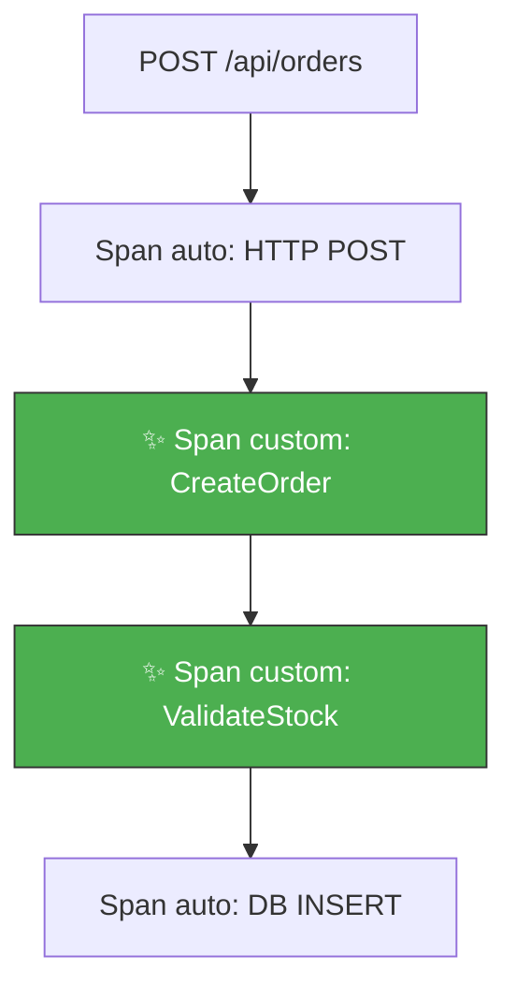
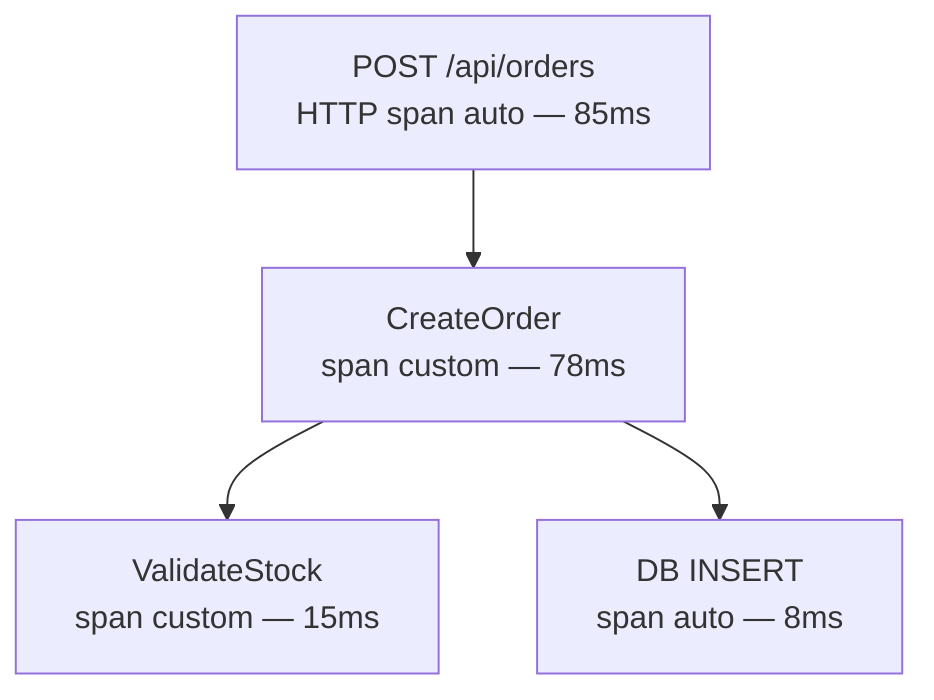

import StepHeader from '@site/src/components/StepHeader';
import Tabs from '@theme/Tabs';
import TabItem from '@theme/TabItem';
import ValidationChecklist from '@site/src/components/ValidationChecklist';
import SignalBadge from '@site/src/components/SignalBadge';
import TerminalOutput from '@site/src/components/TerminalOutput';

<StepHeader number={3} title="Spans Custom" description="Créer des spans personnalisés pour instrumenter la logique métier" />

## Objectif

L'auto-instrumentation capture les appels HTTP et les requêtes base de données, mais la
**logique métier** reste invisible. Dans cette étape, vous allez créer des **spans personnalisés**
pour instrumenter manuellement les opérations métier — comme la création d'une commande et la
validation du stock.

<SignalBadge signal="traces" title="Instrumentation manuelle">
  Les spans custom permettent de rendre visible la **logique métier** dans vos traces.
  Vous pourrez mesurer le temps passé dans chaque étape du traitement d'une commande :
  validation, vérification du stock, persistance, etc.
</SignalBadge>

## Pourquoi des spans custom ?

L'auto-instrumentation ne couvre que les **frontières techniques** (HTTP, DB, messaging).
Pour comprendre le comportement métier, il faut ajouter des spans manuellement :



Les spans en vert sont ceux que vous allez créer dans cette étape.

## Implémenter les spans custom

<Tabs groupId="stack">
<TabItem value="dotnet" label=".NET 10 / Aspire">

### Étape 1 — Créer un ActivitySource

En .NET, les spans OpenTelemetry sont représentés par des `Activity`,
et les sources de spans par des `ActivitySource`. Créez un fichier
dédié pour centraliser vos sources de diagnostic :

```csharp
// ShopTrack.Api/Diagnostics.cs
using System.Diagnostics;

namespace ShopTrack.Api;

public static class Diagnostics
{
    public static readonly string ServiceName = "shoptrack-api";

    // Créer un ActivitySource pour les opérations métier
    public static readonly ActivitySource ActivitySource =
        new(ServiceName);
}
```

### Étape 2 — Enregistrer l'ActivitySource

Pour que le SDK OpenTelemetry écoute votre `ActivitySource`, vous devez
l'ajouter à la configuration du tracing :

```csharp
// Dans Extensions.cs ou Program.cs — configuration OpenTelemetry
builder.Services.AddOpenTelemetry()
    .WithTracing(tracing =>
    {
        tracing.AddSource(Diagnostics.ServiceName) // ← Écouter notre source
               .AddAspNetCoreInstrumentation()
               .AddHttpClientInstrumentation()
               .AddEntityFrameworkCoreInstrumentation();
    });
```

:::danger N'oubliez pas AddSource !
Sans `AddSource(Diagnostics.ServiceName)`, le SDK ne capturera **aucun** span de votre
`ActivitySource`. C'est l'erreur la plus courante avec l'instrumentation manuelle .NET.
:::

### Étape 3 — Créer les spans dans les endpoints

```csharp
// ShopTrack.Api/Endpoints/OrderEndpoints.cs
public static class OrderEndpoints
{
    public static void MapOrderEndpoints(this WebApplication app)
    {
        app.MapPost("/api/orders", async (
            CreateOrderRequest request,
            ShopTrackDbContext db) =>
        {
            // Span parent : CreateOrder
            using var createOrderActivity = Diagnostics.ActivitySource
                .StartActivity("CreateOrder");

            createOrderActivity?.SetTag("order.product_id", request.ProductId);
            createOrderActivity?.SetTag("order.quantity", request.Quantity);

            // Span enfant : ValidateStock
            using (var validateActivity = Diagnostics.ActivitySource
                .StartActivity("ValidateStock"))
            {
                var product = await db.Products
                    .FindAsync(request.ProductId);

                if (product is null)
                {
                    validateActivity?.SetTag("validation.result", "product_not_found");
                    validateActivity?.SetStatus(ActivityStatusCode.Error,
                        "Product not found");
                    return Results.NotFound("Produit introuvable");
                }

                if (product.Stock < request.Quantity)
                {
                    validateActivity?.SetTag("validation.result", "insufficient_stock");
                    validateActivity?.SetTag("validation.available_stock",
                        product.Stock);
                    return Results.BadRequest("Stock insuffisant");
                }

                validateActivity?.SetTag("validation.result", "success");
            }
            // ← Le span ValidateStock se termine ici (fin du using)

            // Créer la commande
            var order = new Order
            {
                ProductId = request.ProductId,
                Quantity = request.Quantity,
                CreatedAt = DateTime.UtcNow
            };
            db.Orders.Add(order);
            await db.SaveChangesAsync();

            createOrderActivity?.SetTag("order.id", order.Id);

            return Results.Created($"/api/orders/{order.Id}", order);
        });
    }
}
```

:::tip Le pattern using pour les spans
En C#, le mot-clé `using` garantit que le span est **automatiquement terminé** à la fin
du bloc. C'est plus sûr que d'appeler `Dispose()` manuellement car le span sera fermé
même en cas d'exception.

Notez que `StartActivity()` peut retourner `null` si aucun listener n'est configuré.
Utilisez toujours l'opérateur `?.` pour les appels de méthodes sur l'activité.
:::

</TabItem>
<TabItem value="java" label="Java 21 / Spring Boot">

### Étape 1 — Obtenir un Tracer

En Java, les spans sont créés via un `Tracer` obtenu depuis l'instance
`OpenTelemetry` globale. Injectez-le dans votre service :

```java
// src/main/java/com/shoptrack/service/OrderService.java
import io.opentelemetry.api.OpenTelemetry;
import io.opentelemetry.api.trace.Span;
import io.opentelemetry.api.trace.StatusCode;
import io.opentelemetry.api.trace.Tracer;
import io.opentelemetry.context.Scope;
import org.springframework.stereotype.Service;

@Service
public class OrderService {

    private final Tracer tracer;
    private final ProductRepository productRepository;
    private final OrderRepository orderRepository;

    public OrderService(OpenTelemetry openTelemetry,
                        ProductRepository productRepository,
                        OrderRepository orderRepository) {
        this.tracer = openTelemetry.getTracer("shoptrack-api");
        this.productRepository = productRepository;
        this.orderRepository = orderRepository;
    }
}
```

### Étape 2 — Créer les spans

```java
// Dans OrderService.java
public Order createOrder(CreateOrderRequest request) {

    // Span parent : CreateOrder
    Span createOrderSpan = tracer.spanBuilder("CreateOrder")
        .setAttribute("order.product_id", request.getProductId())
        .setAttribute("order.quantity", request.getQuantity())
        .startSpan();

    try (Scope scope = createOrderSpan.makeCurrent()) {

        // Span enfant : ValidateStock
        Span validateSpan = tracer.spanBuilder("ValidateStock")
            .startSpan();

        try (Scope validateScope = validateSpan.makeCurrent()) {
            Product product = productRepository
                .findById(request.getProductId())
                .orElse(null);

            if (product == null) {
                validateSpan.setAttribute("validation.result",
                    "product_not_found");
                validateSpan.setStatus(StatusCode.ERROR,
                    "Product not found");
                throw new ProductNotFoundException(
                    "Produit introuvable");
            }

            if (product.getStock() < request.getQuantity()) {
                validateSpan.setAttribute("validation.result",
                    "insufficient_stock");
                validateSpan.setAttribute("validation.available_stock",
                    product.getStock());
                throw new InsufficientStockException(
                    "Stock insuffisant");
            }

            validateSpan.setAttribute("validation.result", "success");
        } finally {
            validateSpan.end(); // ← Toujours terminer le span
        }

        // Créer la commande
        Order order = new Order();
        order.setProductId(request.getProductId());
        order.setQuantity(request.getQuantity());
        order.setCreatedAt(LocalDateTime.now());
        order = orderRepository.save(order);

        createOrderSpan.setAttribute("order.id", order.getId());

        return order;

    } catch (Exception e) {
        createOrderSpan.setStatus(StatusCode.ERROR, e.getMessage());
        createOrderSpan.recordException(e);
        throw e;
    } finally {
        createOrderSpan.end(); // ← Toujours terminer le span
    }
}
```

:::danger N'oubliez pas span.end() !
En Java, les spans **doivent** être explicitement terminés avec `span.end()`.
Utilisez **toujours** un bloc `try-finally` pour garantir que le span est terminé,
même en cas d'exception. Un span non terminé ne sera jamais exporté.
:::

:::tip makeCurrent() et le contexte
L'appel `span.makeCurrent()` enregistre le span comme le span actif dans le thread
courant. Les spans créés ensuite deviennent automatiquement des enfants du span courant.
Le `Scope` retourné doit être fermé (via try-with-resources) pour restaurer le contexte.
:::

</TabItem>
</Tabs>

## Tester l'instrumentation

Créez une commande et observez les traces générées :

<TerminalOutput title="Créer une commande">
```bash
curl -X POST http://localhost:8080/api/orders \
  -H "Content-Type: application/json" \
  -d '{"productId": 1, "quantity": 2}'
```
</TerminalOutput>

Ouvrez Jaeger ([http://localhost:16686](http://localhost:16686)) et cherchez les traces du service
`shoptrack-api`. Vous devriez voir la hiérarchie suivante :



## Bonnes pratiques pour les spans custom

| Pratique | Recommandation |
|----------|---------------|
| **Nommage** | Utilisez des noms courts et descriptifs : `CreateOrder`, pas `create-order-in-database` |
| **Granularité** | Un span par opération métier significative, pas par ligne de code |
| **Attributs** | Ajoutez des attributs métier utiles (IDs, résultats de validation) |
| **Erreurs** | Marquez les spans en erreur avec `SetStatus(Error)` et enregistrez l'exception |
| **Durée de vie** | Terminez toujours vos spans (`using` en C#, `try-finally` en Java) |

:::warning Données sensibles
Ne mettez **jamais** de données personnelles (email, mot de passe, numéro de carte) dans les
attributs des spans. Ces données sont exportées vers les backends d'observabilité et pourraient
être accessibles à des personnes non autorisées.
:::

## Aide & Résolution de problèmes

<details>
<summary>🔇 ActivitySource non écouté (.NET) — StartActivity retourne null</summary>

Si `StartActivity()` retourne toujours `null`, c'est que le SDK n'écoute pas votre `ActivitySource`.

Vérifiez que vous avez ajouté `.AddSource(Diagnostics.ServiceName)` dans la configuration
OpenTelemetry. Le nom passé à `AddSource` doit correspondre **exactement** au nom utilisé
pour créer l'`ActivitySource`.

```csharp
// Le nom doit correspondre
public static readonly ActivitySource ActivitySource = new("shoptrack-api");
// ↕ Même valeur
tracing.AddSource("shoptrack-api");
```
</details>

<details>
<summary>👻 Le span custom n'apparaît pas dans Jaeger</summary>

Causes possibles :
1. Le span n'a pas été correctement terminé (`end()` en Java, `Dispose()` en .NET)
2. Le batch processor n'a pas encore envoyé les données — attendez quelques secondes
3. Le span a été créé mais le Collector ne l'a pas reçu — vérifiez les logs du Collector
4. Le service name est différent — cherchez dans tous les services de Jaeger
</details>

<details>
<summary>🌲 Les spans ne sont pas nestés correctement</summary>

Si les spans `CreateOrder` et `ValidateStock` apparaissent au même niveau au lieu d'être
parent-enfant :

- **Java** : Vérifiez que vous appelez `makeCurrent()` sur le span parent **avant** de créer
  le span enfant. Sans cela, le SDK ne connaît pas la relation parent-enfant.
- **.NET** : Vérifiez que vous créez le span enfant **à l'intérieur** du bloc `using` du span
  parent. Le SDK utilise le `Activity.Current` pour déterminer le parent.
</details>

<details>
<summary>⏱️ Les durées des spans semblent incorrectes</summary>

Si un span montre une durée anormalement longue :
- Vérifiez que le span est bien terminé au bon moment (pas trop tard)
- En Java, assurez-vous que `span.end()` est dans le bon bloc `finally`
- En .NET, vérifiez que le `using` englobe uniquement le code souhaité
</details>

## Checklist de validation

<ValidationChecklist items={[
  "Span 'CreateOrder' visible dans Jaeger",
  "Span 'ValidateStock' enfant de CreateOrder",
  "Spans correctement nestés dans la trace waterfall",
  "Durée des spans cohérente"
]} />
