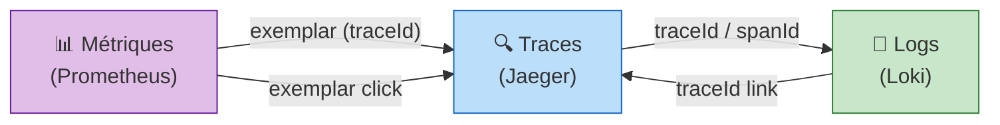

import StepHeader from '@site/src/components/StepHeader';
import Tabs from '@theme/Tabs';
import TabItem from '@theme/TabItem';
import ValidationChecklist from '@site/src/components/ValidationChecklist';
import SignalBadge from '@site/src/components/SignalBadge';
import TerminalOutput from '@site/src/components/TerminalOutput';

<StepHeader number={7} title="Corrélation & Exemplars" description="Naviguer entre traces, métriques et logs grâce aux exemplars et à la corrélation" />

## Signaux impliqués

<div style={{ display: 'flex', gap: '1rem', flexWrap: 'wrap', marginBottom: '1.5rem' }}>

<SignalBadge signal="traces" title="Traces">
  Les traces fournissent le TraceID qui relie tous les signaux entre eux.
</SignalBadge>

<SignalBadge signal="metrics" title="Métriques">
  Les métriques portent des exemplars qui pointent vers des traces spécifiques.
</SignalBadge>

<SignalBadge signal="logs" title="Logs">
  Les logs sont enrichis avec le TraceID pour permettre la navigation vers la trace associée.
</SignalBadge>

</div>

## Concept : Corrélation des signaux

L'un des principaux avantages d'OpenTelemetry est la **corrélation native** entre les trois piliers de
l'observabilité. Plutôt que d'avoir des métriques, des traces et des logs isolés, OTel permet de naviguer
de l'un à l'autre de manière fluide.

La chaîne de corrélation fonctionne ainsi :

```
Métriques → Exemplars → TraceId → Trace → SpanId → Logs
```

:::info Qu'est-ce qu'un Exemplar ?
Un **exemplar** est un échantillon attaché à un point de métrique qui contient un **TraceID** et un **SpanID**.
Il permet de passer d'un pic sur un graphique de métriques directement à la trace qui a provoqué ce pic.
Dans Grafana, les exemplars apparaissent comme des **points violets** sur les graphiques de métriques.
:::

### Diagramme de corrélation



## Implémentation

<Tabs groupId="stack" defaultValue="dotnet" values={[{label: '.NET 10 / Aspire', value: 'dotnet'}, {label: 'Java 21 / Spring Boot', value: 'java'}]}>
<TabItem value="dotnet">

### Exemplars automatiques en .NET

En .NET, les exemplars sont **émis automatiquement** lorsque vous enregistrez une métrique à l'intérieur
d'un span actif. Aucun code supplémentaire n'est nécessaire côté application :

```csharp
// Program.cs - Les exemplars sont automatiques avec OTel .NET
builder.Services.AddOpenTelemetry()
    .WithMetrics(metrics => metrics
        .AddAspNetCoreInstrumentation()
        .AddHttpClientInstrumentation()
        .AddMeter("ShopTrack.Api")
        .AddOtlpExporter()
    )
    .WithTracing(tracing => tracing
        .AddAspNetCoreInstrumentation()
        .AddHttpClientInstrumentation()
        .AddOtlpExporter()
    );
```

Quand un `Counter` ou un `Histogram` est enregistré pendant qu'un span est actif, le SDK .NET OTel
associe automatiquement le `TraceID` et `SpanID` courants comme exemplar.

### Configuration OTel Collector

Ajoutez `enable_open_metrics: true` dans l'exporteur Prometheus du Collector :

```yaml
# otel-collector-config.yml
exporters:
  prometheus:
    endpoint: "0.0.0.0:8889"
    enable_open_metrics: true  # Active les exemplars
```

### Configuration Prometheus

Activez le stockage des exemplars dans Prometheus :

```yaml
# docker-compose.yml - section prometheus
prometheus:
  image: prom/prometheus:latest
  command:
    - '--config.file=/etc/prometheus/prometheus.yml'
    - '--enable-feature=exemplar-storage'  # Indispensable !
  ports:
    - "9090:9090"
```

### Configuration Grafana - Datasources

Configurez les datasources Grafana pour activer la navigation entre signaux :

```yaml
# grafana/provisioning/datasources/datasources.yml
apiVersion: 1
datasources:
  - name: Prometheus
    type: prometheus
    url: http://prometheus:9090
    jsonData:
      exemplarTraceIdDestinations:
        - name: traceID
          datasourceUid: jaeger
          urlDisplayLabel: "Voir la trace"

  - name: Jaeger
    type: jaeger
    url: http://jaeger:16686
    uid: jaeger

  - name: Loki
    type: loki
    url: http://loki:3100
    jsonData:
      derivedFields:
        - name: TraceID
          matcherRegex: '"traceId":"(\w+)"'
          url: '$${__value.raw}'
          datasourceUid: jaeger
          urlDisplayLabel: "Voir la trace"
```

</TabItem>
<TabItem value="java">

### Exemplars automatiques en Java

Le SDK Java OpenTelemetry émet également les exemplars **automatiquement**. Lorsque vous enregistrez
une métrique pendant qu'un span est actif, le TraceID et SpanID sont attachés :

```java
// Les exemplars sont automatiques avec l'agent Java OTel
// Aucun code supplémentaire nécessaire

// Exemple : enregistrement d'une métrique avec exemplar automatique
Meter meter = GlobalOpenTelemetry.getMeter("shoptrack");
LongCounter orderCounter = meter.counterBuilder("orders.count")
    .setDescription("Nombre de commandes")
    .build();

// Si un span est actif, l'exemplar est ajouté automatiquement
orderCounter.add(1, Attributes.of(AttributeKey.stringKey("status"), "completed"));
```

### Configuration OTel Collector

Identique à .NET — ajoutez `enable_open_metrics: true` :

```yaml
# otel-collector-config.yml
exporters:
  prometheus:
    endpoint: "0.0.0.0:8889"
    enable_open_metrics: true  # Active les exemplars
```

### Configuration Prometheus

Activez le stockage des exemplars :

```yaml
# docker-compose.yml - section prometheus
prometheus:
  image: prom/prometheus:latest
  command:
    - '--config.file=/etc/prometheus/prometheus.yml'
    - '--enable-feature=exemplar-storage'
  ports:
    - "9090:9090"
```

### Configuration Grafana - Datasources

Configuration identique pour les liens entre signaux :

```yaml
# grafana/provisioning/datasources/datasources.yml
apiVersion: 1
datasources:
  - name: Prometheus
    type: prometheus
    url: http://prometheus:9090
    jsonData:
      exemplarTraceIdDestinations:
        - name: traceID
          datasourceUid: jaeger
          urlDisplayLabel: "Voir la trace"

  - name: Jaeger
    type: jaeger
    url: http://jaeger:16686
    uid: jaeger

  - name: Loki
    type: loki
    url: http://loki:3100
    jsonData:
      derivedFields:
        - name: TraceID
          matcherRegex: '"traceId":"(\w+)"'
          url: '$${__value.raw}'
          datasourceUid: jaeger
          urlDisplayLabel: "Voir la trace"
```

</TabItem>
</Tabs>

## Navigation dans Grafana

Une fois la configuration en place, la navigation entre signaux fonctionne ainsi :

1. **Métriques → Traces** : Sur un graphique Prometheus dans Grafana, activez l'affichage des exemplars.
   Des **points violets** apparaissent sur la courbe. Chaque point correspond à une requête spécifique.
   Cliquez dessus pour ouvrir la trace dans Jaeger.

2. **Traces → Logs** : Dans Jaeger, chaque span affiche le `traceID`. Dans Grafana Explore avec Loki,
   recherchez ce `traceID` pour voir tous les logs associés.

3. **Logs → Traces** : Grâce aux `derivedFields` de Loki, le `traceID` dans les logs est cliquable
   et ouvre directement la trace dans Jaeger.

:::tip Activer les exemplars dans Grafana
Dans un panel Grafana avec une requête Prometheus, cliquez sur le bouton **Options** du panel,
puis activez **Exemplars**. Les points violets apparaîtront sur le graphique.
:::

## Dépannage

<details>
<summary>🔧 Les exemplars n'apparaissent pas sur les graphiques</summary>

- Vérifiez que `enable_open_metrics: true` est configuré dans l'exporteur Prometheus du Collector
- Vérifiez que `--enable-feature=exemplar-storage` est passé à Prometheus
- Assurez-vous que les métriques sont enregistrées **pendant qu'un span est actif**
- Dans Grafana, activez l'option **Exemplars** dans les options du panel

</details>

<details>
<summary>🔧 Prometheus ne stocke pas les exemplars</summary>

- Le flag `--enable-feature=exemplar-storage` est **obligatoire** depuis Prometheus 2.26+
- Redémarrez Prometheus après modification du `docker-compose.yml`
- Vérifiez avec : `curl http://localhost:9090/api/v1/query_exemplars?query=http_server_duration_bucket`

</details>

<details>
<summary>🔧 Les liens Loki → Jaeger ne fonctionnent pas</summary>

- Vérifiez la regex dans `derivedFields` — elle doit correspondre au format de vos logs
- Assurez-vous que le `datasourceUid` correspond bien à l'UID de la datasource Jaeger
- Testez la regex sur un échantillon de log dans Grafana Explore

</details>

## Validation

<ValidationChecklist items={[
  "Exemplars visibles sur les métriques dans Grafana (points violets)",
  "Clic sur exemplar navigue vers la trace Jaeger",
  "Logs Loki contiennent le traceID cliquable",
  "Navigation Loki → Jaeger fonctionne",
]} />

:::warning Prérequis
Cette étape nécessite que les étapes précédentes (métriques, traces et logs) soient fonctionnelles.
Assurez-vous que les trois signaux sont correctement exportés vers le Collector avant de configurer la corrélation.
:::
