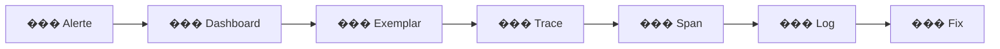

import StepHeader from '@site/src/components/StepHeader';
import Tabs from '@theme/Tabs';
import TabItem from '@theme/TabItem';
import ValidationChecklist from '@site/src/components/ValidationChecklist';
import SignalBadge from '@site/src/components/SignalBadge';
import TerminalOutput from '@site/src/components/TerminalOutput';

<StepHeader number={11} title="Debugging avec OTel" description="Utiliser l'observabilité pour diagnostiquer des problèmes en production" />

<SignalBadge signal="traces" title="Traces">
  Identifier les spans lents et les dépendances problématiques.
</SignalBadge>

<SignalBadge signal="metrics" title="Métriques">
  Détecter les anomalies et les tendances de dégradation.
</SignalBadge>

<SignalBadge signal="logs" title="Logs">
  Trouver la cause racine avec les logs corrélés aux traces.
</SignalBadge>

## Objectif

Dans cette étape, vous allez apprendre la **méthodologie de debugging** basée sur l'observabilité. Plutôt que de deviner, vous utiliserez les trois signaux (métriques, traces, logs) pour diagnostiquer efficacement des problèmes en production.

## Méthodologie : Detect → Investigate → Root cause



:::info Trois étapes clés
1. **Detect** — Les métriques et alertes signalent un problème
2. **Investigate** — Les traces montrent où le temps est passé
3. **Root cause** — Les logs révèlent pourquoi ça a échoué
:::

## Scénario 1 : Latence anormale

### Symptôme

Le dashboard montre que la latence P95 est passée de 200ms à 2s.

### Investigation

1. **Dashboard Grafana** → Identifiez la fenêtre temporelle du pic de latence
2. **Jaeger** → Recherchez les traces longues sur cette période
3. **Détail du span** → Repérez le span le plus long — souvent une requête base de données

<Tabs groupId="stack" defaultValue="dotnet" values={[{label: '.NET 10 / Aspire', value: 'dotnet'}, {label: 'Java 21 / Spring Boot', value: 'java'}]}>
<TabItem value="dotnet">

#### Workflow .NET : Aspire Dashboard + Jaeger + Grafana

1. Ouvrez le **Aspire Dashboard** (`http://localhost:18888`) pour voir les traces en temps réel
2. Filtrez par durée : cliquez sur **Structured** → triez par durée décroissante
3. Repérez un span `db.statement` avec une durée anormale
4. Copiez le `traceId` depuis Aspire
5. Collez-le dans **Jaeger** (`http://localhost:16686`) pour voir le waterfall complet
6. Vérifiez dans **Grafana** si la métrique `db.client.operation.duration` confirme la tendance

```csharp
// Exemple : une requête N+1 non optimisée
var orders = await context.Orders
    .Include(o => o.Items)       // Eager loading — OK
    .ThenInclude(i => i.Product) // Attention : peut générer des requêtes lourdes
    .ToListAsync();
```

</TabItem>
<TabItem value="java">

#### Workflow Java : Jaeger + Grafana + Actuator

1. Ouvrez **Jaeger** (`http://localhost:16686`) et sélectionnez le service `shoptrack-api`
2. Filtrez par `minDuration=1s` pour trouver les traces lentes
3. Dans le waterfall, identifiez le span le plus long (ex: `SELECT` sur la base de données)
4. Vérifiez avec **Spring Boot Actuator** (`/actuator/metrics/db.client.operation.duration`) la latence moyenne
5. Croisez avec **Grafana** pour confirmer la corrélation temporelle

```java
// Exemple : requête non optimisée avec JPA
List<Order> orders = orderRepository.findAll(); // Charge TOUT en mémoire
for (Order order : orders) {
    order.getItems().size(); // Déclenche N requêtes supplémentaires (N+1)
}
```

</TabItem>
</Tabs>

<details>
<summary>��� Astuce : identifier rapidement un span lent</summary>

Dans Jaeger, utilisez le filtre **minDuration** pour ne voir que les traces au-dessus d'un certain seuil. Triez ensuite par durée décroissante pour voir les pires cas en premier.

</details>

## Scénario 2 : Erreurs silencieuses

### Symptôme

Le taux d'erreur HTTP reste à 0%, mais des utilisateurs signalent des commandes non traitées.

### Investigation

1. **Logs Grafana (Loki)** → Recherchez les logs de niveau `Warning`
2. **Corrélation** → Utilisez le `traceId` présent dans le log pour retrouver la trace complète
3. **Trace Jaeger** → Le span `process-order` montre un status `OK` mais un attribut `order.status=pending`

<Tabs groupId="stack" defaultValue="dotnet" values={[{label: '.NET 10 / Aspire', value: 'dotnet'}, {label: 'Java 21 / Spring Boot', value: 'java'}]}>
<TabItem value="dotnet">

```logql
{service_name="shoptrack-api"} | json | level="Warning" | line=~".*order.*"
```

Dans les logs structurés .NET, le `traceId` est automatiquement inclus grâce à l'intégration OpenTelemetry + `ILogger`. Cliquez sur le lien trace dans Grafana pour naviguer directement vers Jaeger.

```csharp
// Ce code ne lève pas d'exception mais crée un problème silencieux
logger.LogWarning("Order {OrderId} payment timeout — marked as pending", order.Id);
// L'ordre reste bloqué sans retry automatique
```

</TabItem>
<TabItem value="java">

```logql
{service_name="shoptrack-api"} | json | level="WARN" | line=~".*order.*"
```

Avec l'instrumentation OpenTelemetry Java, le `traceId` et `spanId` sont automatiquement ajoutés au MDC (Mapped Diagnostic Context). Utilisez-les pour naviguer de Loki vers Jaeger.

```java
// Ce code ne lève pas d'exception mais crée un problème silencieux
log.warn("Order {} payment timeout — marked as pending", order.getId());
// L'ordre reste bloqué sans retry automatique
```

</TabItem>
</Tabs>

<details>
<summary>��� Astuce : corréler logs et traces</summary>

Dans Grafana, configurez un **data link** sur le champ `traceId` de Loki qui pointe vers Jaeger :
```
http://localhost:16686/trace/${__value.raw}
```
Cela permet de naviguer d'un log directement à sa trace en un clic.

</details>

## Scénario 3 : Dégradation progressive

### Symptôme

Le temps de réponse augmente lentement sur 24h — pas d'alerte immédiate car les seuils ne sont pas atteints.

### Investigation

1. **Dashboard Grafana** → Zoomez sur 24h, repérez la tendance croissante de latence
2. **Exemplars** → Si configurés, cliquez sur un point du graphique pour accéder à la trace correspondante
3. **Trace** → Identifiez un span dont la durée croît proportionnellement (ex : cache qui se remplit)

:::tip Exemplars
Les exemplars sont des liens entre un point de métrique et une trace spécifique. Ils permettent de passer directement d'un graphique Prometheus à la trace qui a généré ce point.
:::

<Tabs groupId="stack" defaultValue="dotnet" values={[{label: '.NET 10 / Aspire', value: 'dotnet'}, {label: 'Java 21 / Spring Boot', value: 'java'}]}>
<TabItem value="dotnet">

Pour activer les exemplars en .NET, assurez-vous que votre `Meter` est configuré avec les traces :

```csharp
// Les exemplars sont supportés nativement avec OpenTelemetry .NET
// Prometheus les expose automatiquement si les traces sont actives
builder.Services.AddOpenTelemetry()
    .WithMetrics(m => m.AddPrometheusExporter(o => o.DisableTotalNameSuffixForCounters = false));
```

</TabItem>
<TabItem value="java">

Pour activer les exemplars en Java, vérifiez la configuration Prometheus :

```yaml
# application.yml
management:
  prometheus:
    metrics:
      export:
        enabled: true
  metrics:
    distribution:
      percentiles-histogram:
        http.server.requests: true
```

</TabItem>
</Tabs>

<details>
<summary>��� Astuce : activer les exemplars dans Grafana</summary>

1. Éditez la data source Prometheus dans Grafana
2. Activez **Exemplars** dans les options
3. Configurez le lien vers Jaeger : `http://localhost:16686/trace/${__value.raw}`
4. Dans un panneau Time Series, les exemplars apparaîtront comme des points colorés

</details>

## Résumé de la méthodologie

| Étape | Signal | Outil | Question |
|-------|--------|-------|----------|
| **Detect** | Métriques | Grafana / Alertes | *Quelque chose va mal ?* |
| **Investigate** | Traces | Jaeger | *Où est le problème ?* |
| **Root cause** | Logs | Loki / Grafana | *Pourquoi ça échoue ?* |

:::warning Ce step est optionnel
Il n'y a pas de code à écrire ici. L'objectif est de **pratiquer** la navigation entre les outils et de développer le réflexe Detect → Investigate → Root cause.
:::

## Checklist

<ValidationChecklist items={[
  "Capable d'identifier un span lent dans Jaeger",
  "Capable de naviguer d'une métrique vers une trace via exemplar",
  "Capable de corréler un log d'erreur avec sa trace",
  "Workflow Detect→Investigate→Root cause maîtrisé"
]} />
