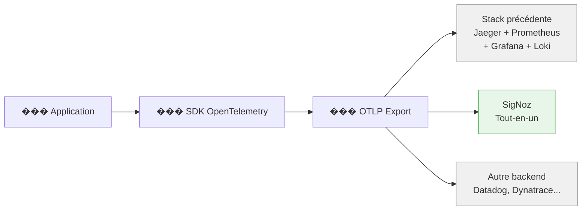

import StepHeader from '@site/src/components/StepHeader';
import Tabs from '@theme/Tabs';
import TabItem from '@theme/TabItem';
import ValidationChecklist from '@site/src/components/ValidationChecklist';
import SignalBadge from '@site/src/components/SignalBadge';
import TerminalOutput from '@site/src/components/TerminalOutput';

<StepHeader number={12} title="SigNoz — Backend Unifié" description="Migrer vers une plateforme d'observabilité tout-en-un sans modifier le code applicatif" />

<SignalBadge signal="traces" title="Portabilité OpenTelemetry">
OpenTelemetry est un standard **vendor-neutral**. Votre instrumentation fonctionne avec n'importe quel backend compatible OTLP — Jaeger, Grafana, SigNoz, Datadog, etc. Cette étape le prouve : **aucune ligne de code ne change**.
</SignalBadge>

## Objectif

Remplacer toute la stack d'observabilité (Jaeger + Prometheus + Grafana + Loki) par **SigNoz**, une plateforme open-source tout-en-un. Vous allez constater que la seule modification nécessaire est l'**URL du endpoint OTLP** — aucun fichier source n'est touché.

:::info Pourquoi SigNoz ?
SigNoz regroupe traces, métriques et logs dans une seule interface. Il utilise **ClickHouse** comme moteur de stockage, ce qui le rend performant pour les requêtes analytiques sur de gros volumes de télémétrie.
:::

## 1. Arrêter la stack existante

Avant de démarrer SigNoz, arrêtez la stack précédente pour libérer les ports et les ressources :

<TerminalOutput>
```bash
cd infra
docker compose down
```
</TerminalOutput>

Vérifiez qu'aucun conteneur ne tourne encore :

<TerminalOutput>
```bash
docker ps
```
</TerminalOutput>

:::warning Conflits de ports
Si des conteneurs sont encore actifs, SigNoz ne pourra pas démarrer correctement. Les ports `4317` (OTLP gRPC) et `4318` (OTLP HTTP) sont particulièrement critiques. Utilisez `docker compose down -v` si nécessaire pour tout nettoyer.
:::

## 2. Démarrer SigNoz

Lancez la stack SigNoz dédiée :

<TerminalOutput>
```bash
cd infra
docker compose -f docker-compose-signoz.yml up -d
```
</TerminalOutput>

:::caution ClickHouse a besoin de temps
ClickHouse (le moteur de stockage de SigNoz) nécessite **30 à 60 secondes** pour s'initialiser complètement. Attendez que tous les conteneurs soient `healthy` avant de continuer.
:::

Vérifiez l'état des conteneurs :

<TerminalOutput>
```bash
docker compose -f docker-compose-signoz.yml ps
```
</TerminalOutput>

Vous devriez voir tous les services en état `healthy` ou `running`. L'interface SigNoz est accessible sur **http://localhost:3301**.

## 3. Configurer l'application

Voici le moment clé de cette étape : **la seule modification est une variable d'environnement**.

<Tabs groupId="stack" defaultValue="dotnet" values={[{label: '.NET 10 / Aspire', value: 'dotnet'}, {label: 'Java 21 / Spring Boot', value: 'java'}]}>
<TabItem value="dotnet">

### Configuration .NET

La seule chose à changer est le endpoint OTLP. Les `ServiceDefaults` gèrent déjà l'export OTLP — il suffit de pointer vers SigNoz.

#### Option 1 : Variable d'environnement

```bash
set OTEL_EXPORTER_OTLP_ENDPOINT=http://localhost:4317
```

#### Option 2 : Configuration dans l'AppHost

```csharp
// ShopTrack.AppHost/Program.cs
var api = builder.AddProject<Projects.ShopTrack_Api>("shoptrack-api")
    .WithEnvironment("OTEL_EXPORTER_OTLP_ENDPOINT", "http://localhost:4317");
```

:::tip ServiceDefaults — Rien à changer !
Le projet `ShopTrack.ServiceDefaults` configure déjà l'export OTLP pour les traces, métriques et logs. La méthode `AddOpenTelemetry()` dans `Extensions.cs` utilise automatiquement la variable `OTEL_EXPORTER_OTLP_ENDPOINT`. **Aucune modification de ce fichier n'est nécessaire.**
:::

#### Ressources requises

SigNoz avec ClickHouse consomme environ **4 Go de RAM**. Vérifiez que Docker Desktop dispose de suffisamment de mémoire :

```
Docker Desktop → Settings → Resources → Memory → 6 Go minimum recommandé
```

</TabItem>
<TabItem value="java">

### Configuration Java

Comme pour .NET, la seule modification est le endpoint OTLP.

#### Option 1 : Variable d'environnement

```bash
export OTEL_EXPORTER_OTLP_ENDPOINT=http://localhost:4317
```

#### Option 2 : Configuration dans application.yml

```yaml
# src/main/resources/application.yml
otel:
  exporter:
    otlp:
      endpoint: http://localhost:4317
```

:::tip Spring Boot OTel Starter
Le starter OpenTelemetry pour Spring Boot lit automatiquement les variables d'environnement `OTEL_*`. Si `OTEL_EXPORTER_OTLP_ENDPOINT` est définie, elle est prioritaire sur la configuration YAML. **Aucun fichier source Java n'est modifié.**
:::

#### Ressources requises

SigNoz avec ClickHouse consomme environ **4 Go de RAM** (contre ~2 Go pour la stack précédente). Assurez-vous que Docker dispose de suffisamment de mémoire :

```bash
docker info | grep "Total Memory"
```

</TabItem>
</Tabs>

## 4. Le point clé : la portabilité OpenTelemetry



:::info AUCUNE modification de code nécessaire
C'est la promesse fondamentale d'OpenTelemetry : **votre instrumentation est découplée du backend**. Que vous utilisiez Jaeger, SigNoz, Datadog ou Dynatrace, le code applicatif reste identique. Seule la configuration d'export change.
:::

## 5. Explorer SigNoz

Ouvrez **http://localhost:3301** et explorez les différentes sections.

### Services — Métriques RED

La page **Services** affiche automatiquement les métriques RED (Rate, Errors, Duration) pour chaque service détecté :

| Métrique | Description | Équivalent stack précédente |
|---|---|---|
| **Rate** | Nombre de requêtes par seconde | Dashboard Grafana custom |
| **Errors** | Pourcentage de requêtes en erreur | Dashboard Grafana custom |
| **Duration** | Latence P50, P95, P99 | Dashboard Grafana custom |

Cliquez sur **shoptrack-api** pour voir les détails du service.

### Traces — Waterfall

La vue **Traces** offre un explorateur similaire à Jaeger :

- Filtrez par service, opération, durée minimale, tags
- Visualisez le diagramme **waterfall** de chaque trace
- Inspectez les attributs, événements et statuts de chaque span

### Metrics Explorer

Le **Metrics Explorer** permet de requêter toutes les métriques, y compris vos métriques custom :

- `orders_created_total` — Compteur de commandes créées
- `orders_total_amount` — Distribution des montants
- `http_server_request_duration` — Latence HTTP (auto-instrumentée)

### Logs

La section **Logs** affiche les logs collectés via OTLP avec :

- Recherche full-text
- Filtrage par niveau (INFO, WARNING, ERROR)
- **Corrélation trace↔log** : cliquez sur un log pour voir la trace associée, et inversement

### Dashboards

SigNoz inclut des **dashboards pré-configurés** et permet d'en créer de nouveaux. Contrairement à Grafana, tout est intégré nativement — pas besoin de configurer des data sources.

## 6. Comparaison : Stack précédente vs SigNoz

| Fonction | Stack précédente | SigNoz |
|---|---|---|
| **Traces** | Jaeger (`localhost:16686`) | SigNoz Traces (intégré) |
| **Métriques** | Prometheus + Grafana | SigNoz Metrics Explorer (intégré) |
| **Logs** | Loki + Grafana | SigNoz Logs (intégré) |
| **Dashboards** | Grafana (config manuelle) | SigNoz Dashboards (pré-configurés) |
| **Corrélation** | Data links manuels Grafana↔Jaeger | Navigation intégrée trace↔log↔métrique |
| **Stockage** | Prometheus (TSDB) + Loki (chunks) | ClickHouse (unifié) |
| **Nb de composants** | 5+ conteneurs | 3 conteneurs (SigNoz + OTel Collector + ClickHouse) |
| **RAM estimée** | ~2 Go | ~4 Go |
| **Configuration** | Multiples fichiers YAML | Un seul docker-compose |

:::tip Quel backend choisir ?
Il n'y a pas de réponse universelle. La stack Jaeger+Prometheus+Grafana offre plus de **flexibilité** et un écosystème plus large. SigNoz offre une **simplicité** d'installation et une expérience unifiée. L'important est que grâce à OpenTelemetry, vous pouvez **changer à tout moment** sans toucher au code.
:::

## Dépannage

<details>
<summary>��� Les conteneurs ne démarrent pas</summary>

Vérifiez qu'aucun port n'est occupé par la stack précédente :

```bash
docker compose down          # Arrêter la stack précédente
docker compose -f docker-compose-signoz.yml up -d
```

Si le problème persiste, vérifiez les logs :

```bash
docker compose -f docker-compose-signoz.yml logs signoz
```

</details>

<details>
<summary>��� ClickHouse est lent à démarrer</summary>

ClickHouse peut prendre 30 à 60 secondes pour s'initialiser. Vérifiez son état :

```bash
docker compose -f docker-compose-signoz.yml ps
```

Attendez que le conteneur `clickhouse` soit `healthy` avant de lancer l'application.

</details>

<details>
<summary>��� Les données n'apparaissent pas dans SigNoz</summary>

1. **Vérifiez le endpoint** : `OTEL_EXPORTER_OTLP_ENDPOINT` doit pointer vers `http://localhost:4317`
2. **Attendez 15 à 30 secondes** après le premier envoi de données
3. **Vérifiez les logs du collector** :

```bash
docker compose -f docker-compose-signoz.yml logs otel-collector
```

4. Générez du trafic en appelant l'API :

```bash
curl http://localhost:5045/api/products
```

</details>

<details>
<summary>��� Mémoire insuffisante</summary>

SigNoz + ClickHouse nécessitent environ **4 Go de RAM** (contre ~2 Go pour la stack précédente). Si Docker manque de mémoire :

- **Docker Desktop** : Settings → Resources → Memory → Augmentez à 6 Go minimum
- **Linux** : Vérifiez avec `free -h` que vous avez assez de RAM disponible

</details>

## Résumé

Dans cette étape, vous avez :

- ✅ Remplacé 5+ composants par une plateforme unifiée
- ✅ Constaté que **zéro ligne de code** n'a été modifiée
- ✅ Exploré traces, métriques, logs et dashboards dans une interface unique
- ✅ Vérifié la **portabilité** d'OpenTelemetry : changez de backend, gardez votre code

:::info La leçon clé
OpenTelemetry découple votre instrumentation du backend d'observabilité. Investir dans l'instrumentation OpenTelemetry, c'est investir dans la **liberté de choix** — aujourd'hui et demain.
:::

<ValidationChecklist items={[
  "SigNoz est démarré : tous les conteneurs healthy",
  "Le service shoptrack-api apparaît dans Services avec métriques RED",
  "Les traces sont visibles avec diagramme waterfall",
  "Les métriques custom (orders_created_total) apparaissent",
  "Les logs sont visibles avec corrélation trace↔log",
  "AUCUN fichier source (.cs/.java) n'a été modifié"
]} />
