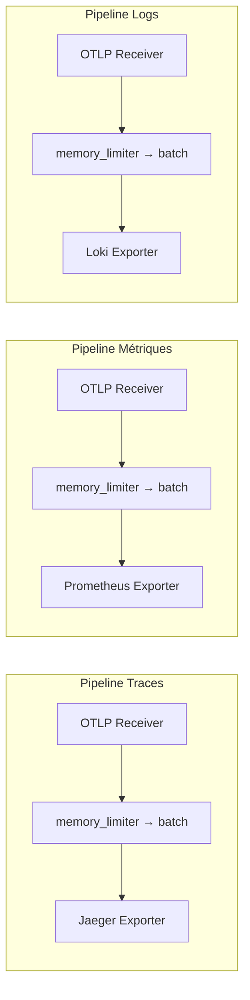

# Configuration du Collector

Le Collector OpenTelemetry est configuré via le fichier `infra/otel-collector-config.yml`. Cette page détaille chaque section de la configuration.

## Structure du fichier

Le fichier de configuration suit cette structure :

```
receivers:     → Comment recevoir les données
processors:    → Comment traiter les données
exporters:     → Où envoyer les données
service:
  pipelines:   → Comment assembler le tout
```

---

## Receivers (Réception)

Les receivers définissent comment le Collector accepte les données de télémétrie.

```yaml
receivers:
  otlp:
    protocols:
      grpc:
        endpoint: 0.0.0.0:4317
      http:
        endpoint: 0.0.0.0:4318
```

| Protocole | Port | Usage |
|-----------|------|-------|
| **gRPC** | 4317 | Protocole binaire performant, recommandé pour la production |
| **HTTP** | 4318 | Protocole texte, utile pour le debug et les environnements avec restrictions réseau |

:::info Deux protocoles, un seul receiver
Le receiver `otlp` peut écouter simultanément en gRPC et HTTP. Les deux acceptent les trois signaux (traces, métriques, logs).
:::

---

## Processors (Traitement)

Les processors transforment et filtrent les données entre la réception et l'export.

### batch

Regroupe les données en lots pour optimiser les performances d'export :

```yaml
processors:
  batch:
    timeout: 5s
    send_batch_size: 1024
```

### memory_limiter

Protège le Collector contre les surcharges mémoire :

```yaml
processors:
  memory_limiter:
    check_interval: 1s
    limit_mib: 512
    spike_limit_mib: 128
```

:::caution Ordre des processors
L'ordre des processors dans la pipeline est important. Placez toujours `memory_limiter` **en premier** pour protéger le Collector.
:::

---

## Exporters (Export)

Les exporters définissent les destinations des données.

### Traces → Jaeger

```yaml
exporters:
  otlp/jaeger:
    endpoint: jaeger:4317
    tls:
      insecure: true
```

### Métriques → Prometheus

```yaml
exporters:
  prometheus:
    endpoint: 0.0.0.0:8889
```

:::info Mode pull
Prometheus fonctionne en mode **pull** : il vient scraper l'endpoint exposé par le Collector. Le Collector n'envoie pas activement les données.
:::

### Logs → Loki

```yaml
exporters:
  loki:
    endpoint: http://loki:3100/loki/api/v1/push
```

---

## Pipelines (Assemblage)

Les pipelines connectent receivers, processors et exporters pour chaque signal :

```yaml
service:
  pipelines:
    traces:
      receivers: [otlp]
      processors: [memory_limiter, batch]
      exporters: [otlp/jaeger]

    metrics:
      receivers: [otlp]
      processors: [memory_limiter, batch]
      exporters: [prometheus]

    logs:
      receivers: [otlp]
      processors: [memory_limiter, batch]
      exporters: [loki]
```

### Visualisation des pipelines



---

## Vérification

Pour vérifier que le Collector fonctionne correctement :

```bash
# Vérifier les logs du Collector
docker compose logs otel-collector

# Vérifier que les ports sont ouverts
curl -s http://localhost:4318/v1/traces -X POST -H "Content-Type: application/json" -d '{}'
```

:::tip Debug
Ajoutez un exporter `debug` dans votre pipeline pour voir les données dans les logs du Collector :
```yaml
exporters:
  debug:
    verbosity: detailed
```
:::
