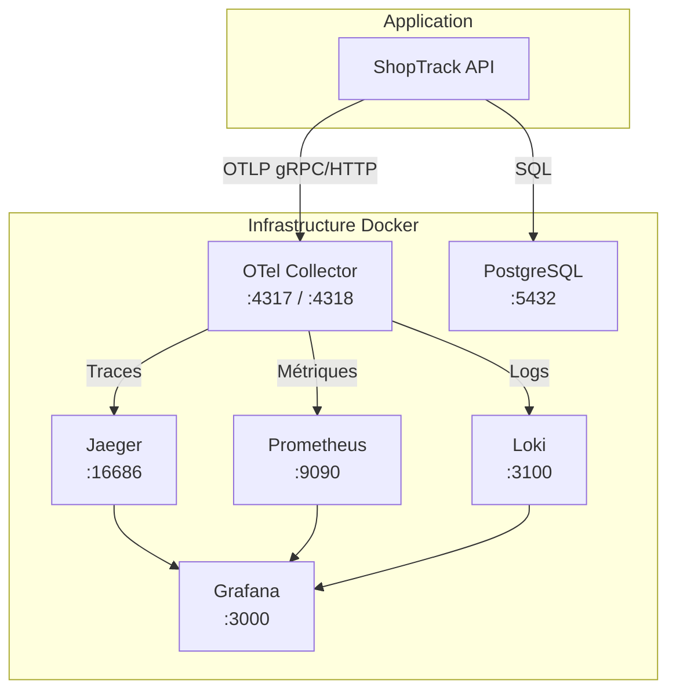

# Infrastructure d'Observabilité

Le DoJo inclut une infrastructure complète d'observabilité déployée via **Docker Compose**. Cette infrastructure collecte, stocke et visualise les données de télémétrie émises par votre application.

## Architecture

## Composants

| Service | Rôle | Port |
|---------|------|------|
| **PostgreSQL** | Base de données applicative | 5432 |
| **OTel Collector** | Point d'entrée de la télémétrie | 4317, 4318 |
| **Jaeger** | Stockage et visualisation des traces | 16686 |
| **Prometheus** | Stockage et requêtage des métriques | 9090 |
| **Loki** | Stockage et requêtage des logs | 3100 |
| **Grafana** | Tableaux de bord unifiés | 3000 |

:::info Pré-configuré
L'infrastructure est entièrement pré-configurée. Les datasources Grafana (Jaeger, Prometheus, Loki) sont provisionnées automatiquement au démarrage.
:::

## Dans cette section

- 🐳 [**Docker Compose**](./docker-compose) — Détail des services et démarrage
- ⚙️ [**Configuration du Collector**](./collector-config) — Pipelines du Collector OTel
- 📊 [**Backends d'observabilité**](./backends) — Utilisation de Jaeger, Prometheus, Grafana et Loki
