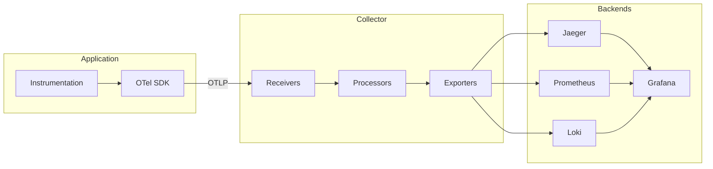

# Architecture OpenTelemetry

---

# Vue d'ensemble



<!--
L'architecture se compose de trois couches : instrumentation dans l'application, SDK qui collecte et exporte, et Collector qui traite et route.
-->

---

# Le Collector

Le **Collector** centralise la réception, le traitement et l'export des données de télémétrie.

<v-clicks>

- **Receivers** — Point d'entrée (OTLP gRPC :4317, HTTP :4318)
- **Processors** — Batch, filtrage, enrichissement, sampling
- **Exporters** — Envoi vers Jaeger, Prometheus, Loki, etc.

</v-clicks>

<v-click>

```yaml
receivers:
  otlp:
    protocols:
      grpc:
        endpoint: 0.0.0.0:4317
      http:
        endpoint: 0.0.0.0:4318

processors:
  batch:
    timeout: 5s

exporters:
  otlp/jaeger:
    endpoint: jaeger:4317
```

</v-click>

---
layout: section
---

# Notre stack d'observabilité

---

# Stack du DoJo

| Composant | Rôle | Port |
|-----------|------|------|
| **OTel Collector** | Réception & routage | `:4317` / `:4318` |
| **Jaeger** | Visualisation des traces | `:16686` |
| **Prometheus** | Stockage des métriques | `:9090` |
| **Loki** | Agrégation des logs | `:3100` |
| **Grafana** | Dashboards unifiés | `:3000` |

<v-click>

```bash
cd infra
docker compose up -d
```

</v-click>

<!--
Toute la stack se lance avec une seule commande Docker Compose. Aucun backend à configurer manuellement.
-->
