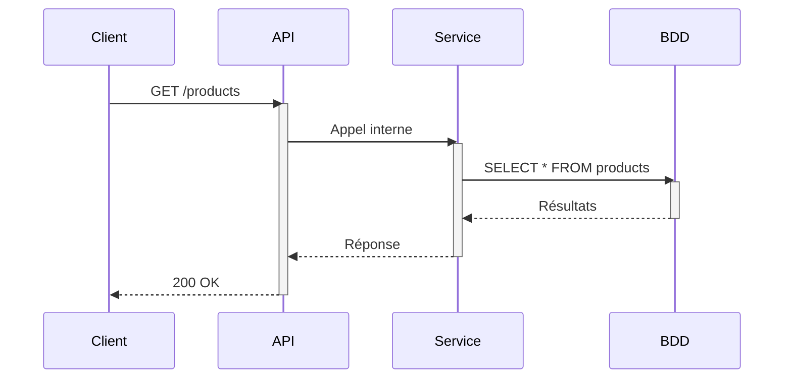

# Les 3 piliers de l'observabilité

---

# 🔗 Traces distribuées

Une **trace** représente le parcours complet d'une requête à travers le système.



<!--
Chaque flèche représente un span. L'ensemble forme une trace identifiée par un TraceId unique.
-->

---

# 🔗 Anatomie d'un Span

<v-clicks>

| Champ | Description |
|-------|-------------|
| `TraceId` | Identifiant unique de la trace (128 bits) |
| `SpanId` | Identifiant unique du span (64 bits) |
| `ParentSpanId` | Lien vers le span parent |
| `Name` | Nom de l'opération — ex: `GET /products` |
| `Attributes` | Paires clé-valeur métier |
| `Events` | Événements horodatés dans le span |
| `Status` | `Ok`, `Error`, ou `Unset` |

</v-clicks>

---

# 📊 Métriques

Des **mesures numériques agrégées** dans le temps pour surveiller la santé de votre application.

<v-clicks>

| Instrument | Description | Exemple |
|------------|-------------|---------|
| **Counter** | Valeur croissante uniquement | Nombre de requêtes |
| **UpDownCounter** | Augmente ou diminue | Connexions actives |
| **Histogram** | Distribution de valeurs | Durée des requêtes |
| **Gauge** | Valeur ponctuelle | Utilisation mémoire |

</v-clicks>

<!--
Les métriques sont agrégées côté SDK avant export, ce qui réduit considérablement le volume de données.
-->

---

# 📝 Logs structurés

Les logs OpenTelemetry sont **automatiquement corrélés** avec les traces.

<v-clicks>

- Utilisent le framework natif (ILogger en .NET, SLF4J en Java)
- Le SDK OTel capture les logs via un modèle de **bridge**
- Chaque log contient le `TraceId` et `SpanId` du contexte courant
- Permet de naviguer d'une trace vers les logs associés

</v-clicks>

<v-click>

```json
{
  "timestamp": "2024-01-15T10:30:00Z",
  "severity": "Information",
  "body": "Produit ajouté au panier",
  "traceId": "abc123def456...",
  "spanId": "789ghi...",
  "attributes": { "product.id": "42", "user.id": "u-100" }
}
```

</v-click>
