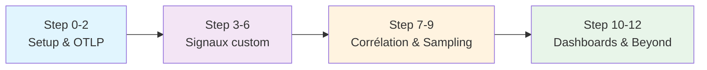

# Programme du DoJo

---
layout: two-cols
---

# Étapes 0 — 6

<v-clicks>

- **Step 0** — Setup & Lancement
- **Step 1** — Auto-instrumentation
- **Step 2** — Exporter OTLP
- **Step 3** — Spans Custom
- **Step 4** — Attributs, Events & Status
- **Step 5** — Métriques Custom
- **Step 6** — Logs Structurés

</v-clicks>

::right::

# Étapes 7 — 12

<v-clicks>

- **Step 7** — Corrélation & Exemplars
- **Step 8** — Propagation de Contexte
- **Step 9** — Sampling
- **Step 10** — Dashboards Grafana
- **Step 11** — Debugging avec OTel
- **Step 12** — SigNoz — Backend Unifié

</v-clicks>

---

# De l'instrumentation au dashboard

<v-click>

> **Approche progressive** : chaque étape s'appuie sur la précédente. Vous construisez une observabilité complète, brique par brique.

</v-click>

---
layout: center
---

# Prêts à commencer ? 🚀

<v-clicks>

**1.** Lancez la stack : `docker compose up -d`

**2.** Ouvrez le DoJo : **Step 0 — Setup & Lancement**

**3.** Instrumentez, observez, maîtrisez !

</v-clicks>

<!--
C'est parti ! Rendez-vous sur le Step 0 pour configurer votre environnement.
-->
